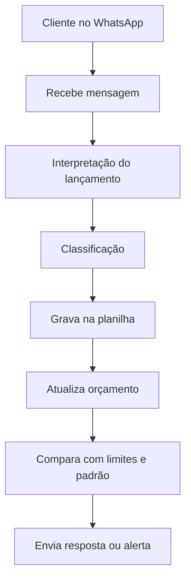

# Agente de Controle Financeiro

## Visão Geral

Agente para WhatsApp que ajuda o usuário a controlar receitas, despesas e compras, registrando lançamentos em uma planilha e acompanhando o orçamento com base no histórico de transações.

---

## Caso de Uso

### Problema
O usuário precisa acompanhar seu orçamento mensal, identificar gastos fora do padrão e receber alertas quando receitas ou despesas fogem do planejado.

### Solução
O agente interpreta mensagens enviadas pelo WhatsApp, classifica os lançamentos, grava as transações em uma planilha e compara os valores com os limites definidos no perfil financeiro do usuário.

### Público-Alvo
Pessoas que desejam controle financeiro pessoal com simplicidade e acompanhamento contínuo via WhatsApp.

---

## Persona e Tom de Voz

### Nome do Agente
Cris

### Personalidade
Consultiva, cuidadosa e objetiva. O agente orienta sem julgar e destaca desvios com clareza.

### Tom de Comunicação
- Informal
- Acolhedor
- Claro e direto

### Exemplos de Linguagem
- Saudação: “Olá! Vou registrar e conferir esse lançamento.”
- Confirmação: “Certo! Já estou salvando na planilha.”
- Alerta: “Esse valor está acima do que você costuma gastar nessa categoria.”
- Erro/Limitação: “Não consegui interpretar esse lançamento. Pode me enviar com mais detalhes?”

---

## Funcionalidades

- Receber lançamentos via WhatsApp
- Classificar como receita ou despesa
- Identificar categoria e subcategoria
- Registrar transações em planilha
- Atualizar orçamento automaticamente
- Comparar valores com limites esperados
- Detectar desvios do padrão de consumo
- Emitir alertas quando houver estouro de limite

---

## Arquitetura

### Diagrama

### Componentes

| Componente | Descrição |
|------------|-----------|
| Interface | WhatsApp ou chatbot web |
| LLM | [Ollama](https://ollama.com/) (local) | 
| Motor de Classificação | Identifica tipo, categoria e subcategoria | 
| Planilha / Banco de Dados | Armazena os lançamentos feitos pelo usuário | 
| Motor de Orçamento | Atualiza saldo, entradas, saídas e limites | 
| Perfil do Usuário | Regras, limites, metas e padrões de consumo | 
| Compras de Interesse | Itens com limites específicos e alertas críticos |
| Histórico de Transações | Base para comparação de comportamento |
| Regras de Alerta | Critérios de comparação e severidade |
| Validação | Checagem de consistência e classificação |

---

## Segurança e Anti-Alucinação

## Fluxo de Funcionamento
1. O usuário envia uma mensagem pelo WhatsApp.
2. O agente interpreta o lançamento.
3. O agente classifica o lançamento.
4. O agente grava os dados na planilha.
5. O agente atualiza o orçamento.
6. O agente compara o lançamento com limites e padrão de consumo.
7. O agente responde com confirmação, resumo ou alerta.

### Estratégias Adotadas

- [X] Agente só responde com base nos dados fornecidos
- [X] Quando faltar contexto, pede esclarecimento.
- [X] Quando não souber classificar, sinaliza incerteza.
- [X] Não inventa limites, categorias ou padrões.

### Limitações Declaradas
> O que o agente NÃO faz?

O agente não executa operações financeiras reais. Ele apenas registra, classifica e acompanha lançamentos, além de emitir alertas com base nas regras configuradas.